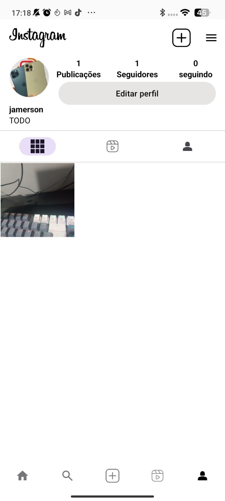

# Instagram Complete
Clone do Instagram com as principais funcionalidades do App Oficial do instagram

# Funcionalidades
- Login e Logout
- Feed de Posts
- Buscar Usuario
- Upload de foto pela Galeria e Camera
# Tecnologias utilizadas
- Kotlin
- MVP
- Firebase
- CameraX
- ViewPager
## Layout mobile

  
  
  

